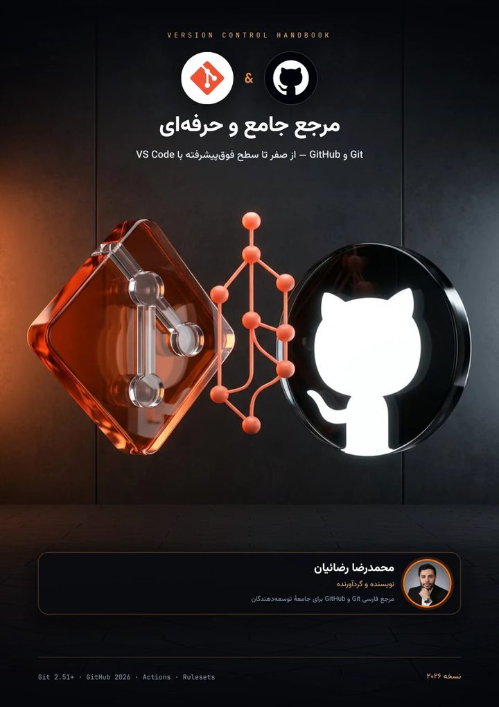

 
 

# Hey, I'm Mohammadreza 👋

### Front-End Engineer · React & Next.js

I turn ideas into web products that real people use every day —  
fast, accessible, and built to be maintained by someone other than me.

 

 
 

  
  
  

 

---

## 🧭 A little about me

Three-ish years ago I wrote my first React component. Since then I've shipped a full-stack medical booking platform, a real-estate app with an interactive map, an e-commerce store for a client, and four Persian handbooks that a lot of developers now learn from.

What gets me out of bed isn't a shiny new framework — it's the moment an interface *just works*: the Jalali calendar that never drifts by a day, the RTL layout that sits right on every screen, the page that's loaded before the user blinks.

Things I quietly refuse to compromise on:

- 🧼 **Clean, quiet code** — readable today, maintainable next year, no complexity nobody asked for
- 🛡️ **Type-safe end to end** — strict TypeScript and Zod at the data boundary; bugs get caught before runtime
- ⚡ **Measured quality** — Lighthouse, automated tests and a11y. A good feeling isn't enough; I want numbers
- 🇮🇷 **The Persian web, done right** — RTL, Jalali dates, Tehran time and everything in between

> *"No quick patches — I go after the root cause."*

 

## 🚀 What I've built

The full stories, screenshots and numbers live on the portfolio — here's the short version.

| | Project | In one line | |
|:-:|:--|:--|:--|
| 🩺 | **Doctor Booking** | Full-stack appointment platform — Next.js 16, MongoDB, Redis, Playwright. Lighthouse SEO **100**. | [Source](https://github.com/rezaian-dev/doctor-booking) |
| 🏠 | **Saghfinoo** | Real-estate SPA with map-based search, built to scale — React 18, Vite, Leaflet. | [Source](https://github.com/rezaian-dev/saghfinoo) |
| 👗 | **Malli Kids** | E-commerce for a children's atelier — RSC, ISR, Better Auth. *Client work, private.* | — |
| 🛒 | **ShoppingCart** | A tidy, strict-TypeScript cart with a modular architecture. | [Source](https://github.com/rezaian-dev/shopping-cart-ts) |

   
  <a href="https://rezaian-dev.vercel.app/fa#projects"><b>See them in detail →</b></a>

 

## 📚 The handbooks I wish I'd had earlier

Four free, open-source Persian guides — project-based, obsessed with the *why*, not just the *how*.

<table align="center">
  <tr>
    <td align="center" width="25%">
        
      <b>JavaScript ES2025</b> 38 chapters  
      
      
    </td>
    <td align="center" width="25%">
        
      <b>React 19.2</b> 37 chapters  
      
      
    </td>
    <td align="center" width="25%">
        
      <b>Next.js 16</b> 37 chapters  
      
      
    </td>
    <td align="center" width="25%">
        
      <b>Git & GitHub 2026</b> 36 chapters  
      
      
    </td>
  </tr>
</table>

 

## 🛠️ What I reach for

 

## 🌐 The portfolio itself

Bilingual, light & dark, zero layout shift — and yes, I measured it.

<table align="center" width="100%">
  <tr>
    <td align="center"></td>
    <td align="center"></td>
  </tr>
  <tr>
    <td align="center"><a href="https://rezaian-dev.vercel.app/fa">🇮🇷 فارسی</a></td>
    <td align="center"><a href="https://rezaian-dev.vercel.app/en">🇬🇧 English</a></td>
  </tr>
</table>

 

## 📫 Say hi

Looking for a front-end engineer who cares about the pixels, the performance *and* the Persian-speaking user in equal measure? I'd love to chat — remote or on-site.

 
 

---

  Designed & engineered with care in Karaj · © 2026 Mohammadreza Rezaian · <a href="#top">Back to top ↑</a>

