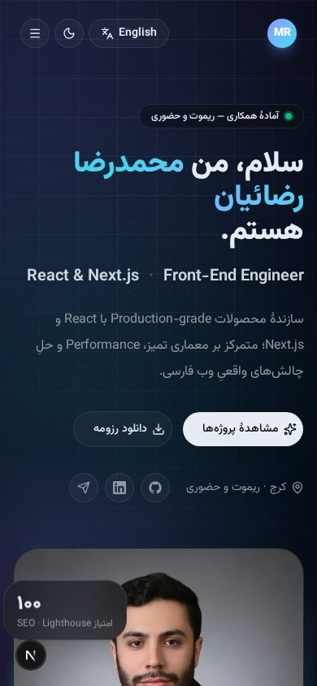

<a id="top"></a>

<div align="center">


<br />
<br />

# Mohammadreza Rezaian — Portfolio

**A bilingual, themeable, zero-layout-shift personal portfolio.**  
Built with the same production standards I bring to client work.

<br />

<p>
  
  
  
  
  
  
</p>

<p>
  
  
  
  
  
  
</p>

<br />

<a href="#-preview">Preview</a> ·
<a href="#-features">Features</a> ·
<a href="#-tech-stack">Tech Stack</a> ·
<a href="#-getting-started">Getting Started</a> ·
<a href="#-project-structure">Structure</a> ·
<a href="#-editing-content">Content</a> ·
<a href="#-quality--performance">Quality</a> ·
<a href="#-deployment">Deploy</a>

</div>

<br />

---

## 📸 Preview

<table align="center" width="100%">
  <tr>
    <td align="center" width="50%"><b>🌙 Persian · Dark · RTL</b></td>
    <td align="center" width="50%"><b>☀️ English · Light · LTR</b></td>
  </tr>
  <tr>
    <td></td>
    <td></td>
  </tr>
</table>

<details>
<summary><b>📱 Mobile preview</b></summary>
<br />
<p align="center"></p>
</details>

<br />

## ✨ Features

<table>
  <tr>
    <td width="50%" valign="top">

### 🌐 Bilingual by design
- `/fa` — Persian, **RTL**, Vazirmatn
- `/en` — English, **LTR**, Inter
- Root `/` redirects via **cookie → Accept-Language → default**
- One typed dictionary: a missing translation is a **compile error**

### 🌓 Theming without flash
- Light / Dark / System via `next-themes`
- Theme class is applied **before first paint**
- shadcn semantic tokens (`--primary`, `--card`, …) in OKLCH

### 🧩 shadcn/ui on Radix
- Button · Badge · Card · Sheet · Tooltip · DropdownMenu · Separator
- Radix `Direction.Provider` for correct RTL behaviour

</td>
<td width="50%" valign="top">

### 🎬 Motion that never reflows
- Tailwind v4 `@theme` keyframes: blobs, marquee, shimmer, conic ring
- Motion for scroll-reveal, magnetic buttons, scroll progress
- **Transform / opacity only** — `prefers-reduced-motion` respected

### 🖼️ Image pipeline
- `next/image` · AVIF / WebP · quality **90–95**
- Inline **blur placeholders** for every asset
- Fixed aspect-ratio boxes — zero pop-in

### 🔤 Self-hosted fonts
- `next/font/local` with **preload** + metric-matched fallback
- No external font requests, no FOUT

</td>
  </tr>
</table>

<br />

## 🛠️ Tech Stack

| Layer | Choice | Why |
|:--|:--|:--|
| **Framework** | Next.js 16 · App Router · Turbopack | RSC by default, SSG for both locales, `proxy.ts` for locale routing |
| **UI** | React 19 · shadcn/ui · Radix UI | Accessible primitives on semantic design tokens |
| **Styling** | Tailwind CSS v4 | CSS-first config, `@theme` / `@utility`, logical properties for RTL |
| **Animation** | Motion 13 + CSS keyframes | Spring physics where it matters, pure CSS where it doesn't |
| **Theming** | next-themes | Class strategy, system-aware, flash-free |
| **Typography** | Vazirmatn · Inter (variable) | Self-hosted via `next/font/local` |
| **Language** | TypeScript (strict) | Content dictionary is fully typed |

<br />

## 🚀 Getting Started

```bash
# 1️⃣ Clone
git clone https://github.com/rezaian-dev/rezaian-dev.git
cd rezaian-dev

# 2️⃣ Install
npm install

# 3️⃣ Develop
npm run dev          # → http://localhost:3000  (redirects to /fa or /en)

# 4️⃣ Production
npm run build && npm start
```

> **Requirements:** Node.js ≥ 20 · npm ≥ 10

<br />

## 🗂️ Project Structure

```
src/
├── 📁 app/
│   ├── layout.tsx               🌱 Root pass-through
│   ├── globals.css              🎨 Tokens · themes · utilities · keyframes
│   ├── not-found.tsx            🚧 404
│   └── [locale]/
│       ├── layout.tsx           🌐 <html lang dir> · fonts · providers · metadata
│       └── page.tsx             🏠 Section composition
├── 📁 components/
│   ├── Navbar · Hero · About · Projects · Books · Skills · Highlights · Contact · Footer
│   ├── shared/                  ♻️ Reveal · GlowCard · Magnetic · ThemeToggle · LangToggle · Background
│   ├── providers/               🌓 ThemeProvider
│   └── ui/                      🧩 shadcn/ui primitives
├── 📁 data/
│   ├── content.ts               📝 Single source of truth — all copy, links, projects (FA + EN)
│   └── blur.ts                  🌫️ Base64 blur placeholders
├── 📁 fonts/                    🔤 Vazirmatn · Inter (variable woff2)
├── 📁 lib/                      🛠️ fonts.ts · utils.ts
└── proxy.ts                     🔀 Locale redirect
public/                          🖼️ Photo · project covers · resume PDF
```

<br />

## ✏️ Editing Content

Everything you see on the page comes from **one file**: [`src/data/content.ts`](src/data/content.ts).

```ts
// The `fa` and `en` objects share a single type — forget a key and the build fails 💥
const en: Content = {
  hero: { name: "Mohammadreza Rezaian", role: "Front-End Engineer", /* … */ },
  projects: {
    items: [
      {
        slug: "doctor-booking",
        title: "Doctor Booking",
        github: "https://github.com/rezaian-dev/doctor-booking",
        demo: "https://…",            // 👈 add this to show a "Live Demo" button
        client: false,               // 👈 true hides source & shows a "Client Work" badge
        // …
      },
    ],
  },
};
```

| I want to… | Edit |
|:--|:--|
| Change any text, link or metric | `src/data/content.ts` |
| Swap the profile photo | `public/images/profile.jpg` (4:5 works best) |
| Add / replace a project cover | `public/images/projects/*.jpg` + regenerate `src/data/blur.ts` |
| Update the resume | `public/MohammadReza_Rezaian_Resume.pdf` |
| Add a shadcn component | `npx shadcn@latest add <name>` |
| Tweak colours | `:root` / `.dark` tokens in `src/app/globals.css` |

<br />

## 🧪 Quality & Performance

Every scenario below was measured with Playwright against the **production build** using the `layout-shift` PerformanceObserver.

| Scenario | CLS | Notes |
|:--|:--:|:--|
| FA · Dark · Desktop | **0.0000** | |
| FA · Light · Desktop | **0.0000** | |
| EN · Dark · Desktop | **0.0000** | |
| EN · Light · Desktop | **0.0000** | |
| FA · Mobile (390 px) | **0.0000** | |
| EN · Mobile (390 px) | **0.0000** | |
| FA · Desktop · **Slow 3G** | **0.0000** | fonts + images throttled |
| EN · Mobile · **Slow 3G** | **0.0000** | fonts + images throttled |

| Check | Result |
|:--|:--:|
| Theme class present at first paint (DOMContentLoaded) | ✅ |
| `<h1>` position unchanged after theme switch | ✅ |
| Page unchanged when mobile Sheet opens / closes | ✅ |
| Hydration warnings / console errors | **0** |
| External font requests | **0** |
| `tsc --noEmit` · `next build` | clean · `/fa` + `/en` SSG |

<details>
<summary><b>How zero CLS is achieved</b></summary>
<br />

- **Fonts** — `next/font/local` preloads both variable fonts and generates a metric-matched fallback (`adjustFontFallback`), so text never re-flows on swap.
- **Images** — every `next/image` sits in a fixed aspect-ratio box and ships an inline blur placeholder.
- **Animations** — only `transform` and `opacity` are animated; nothing that affects layout.
- **Overlays** — `scrollbar-gutter: stable` prevents the horizontal jump when Sheet / Dropdown lock scrolling.
- **Theme** — `next-themes` injects its bootstrap script *before* `<main>`; `suppressHydrationWarning` keeps React quiet.

</details>

<br />

## ☁️ Deployment

<table>
  <tr>
    <td align="center" width="33%">
      <b>▲ Vercel</b><br /><sub>Import the repo — no configuration needed.<br />Root redirects to <code>/fa</code> or <code>/en</code>.</sub>
    </td>
    <td align="center" width="33%">
      <b>🐳 Docker / Node</b><br /><sub><code>npm run build && npm start</code><br />Set <code>-H 0.0.0.0</code> for containers.</sub>
    </td>
    <td align="center" width="33%">
      <b>🌍 Custom domain</b><br /><sub>Update <code>metadataBase</code> in<br /><code>src/app/[locale]/layout.tsx</code>.</sub>
    </td>
  </tr>
</table>

<br />

## 🧭 Engineering Principles

> **“I fix the root cause instead of applying a quick patch.”**

| | |
|:--|:--|
| 🔒 **Full type-safety** | TypeScript strict; the content dictionary is the schema |
| 🧹 **Clean, lean code** | One responsibility per file; comments explain *why*, not *what* |
| 🎯 **Minimal scope** | Only what the product needs — no unused abstractions |
| 📏 **Measurable quality** | CLS, a11y and build health are checked, not assumed |

<br />

## 📫 Contact

<div align="center">

<a href="mailto:mrezaian.dev@gmail.com"></a>
<a href="https://www.linkedin.com/in/mr-rezaian"></a>
<a href="https://t.me/rezaian_dev"></a>
<a href="https://github.com/rezaian-dev"></a>

<br />
<br />

**Karaj, Iran · Open to remote & on-site roles**

</div>

<br />

---

<div align="center">
  <sub>
    Designed &amp; built by <b>Mohammadreza Rezaian</b> · © 2026 ·
    <a href="#top">Back to top ↑</a>
  </sub>
</div>
