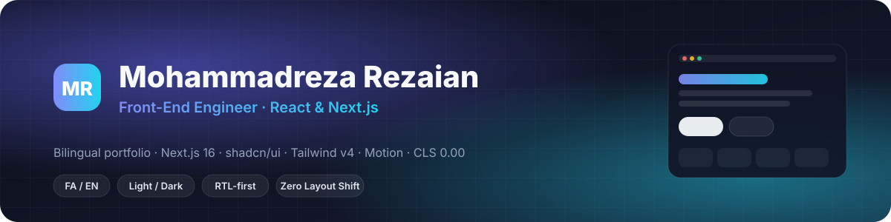
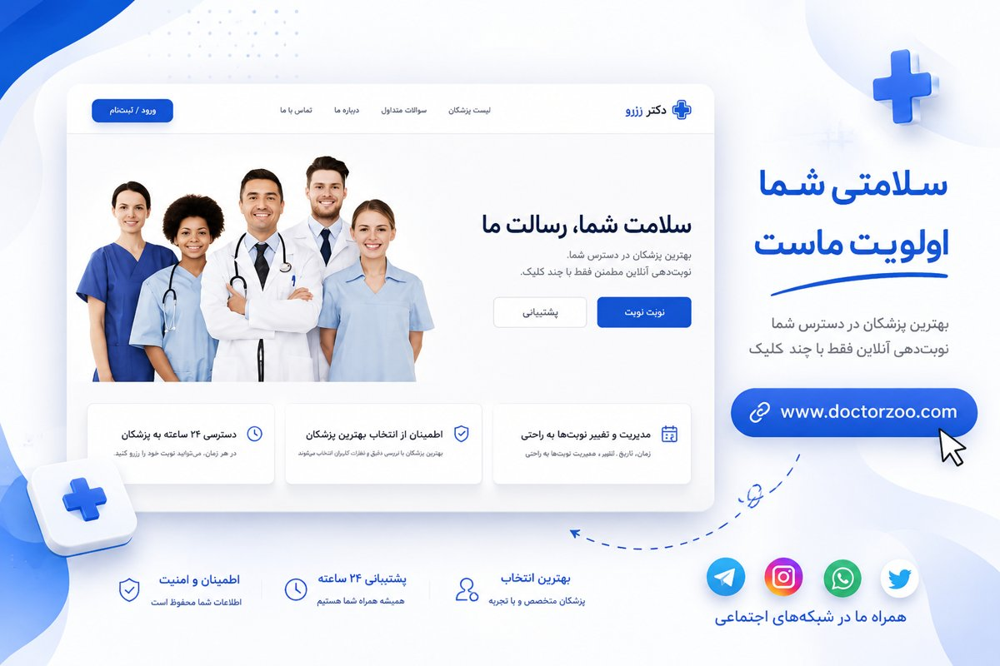
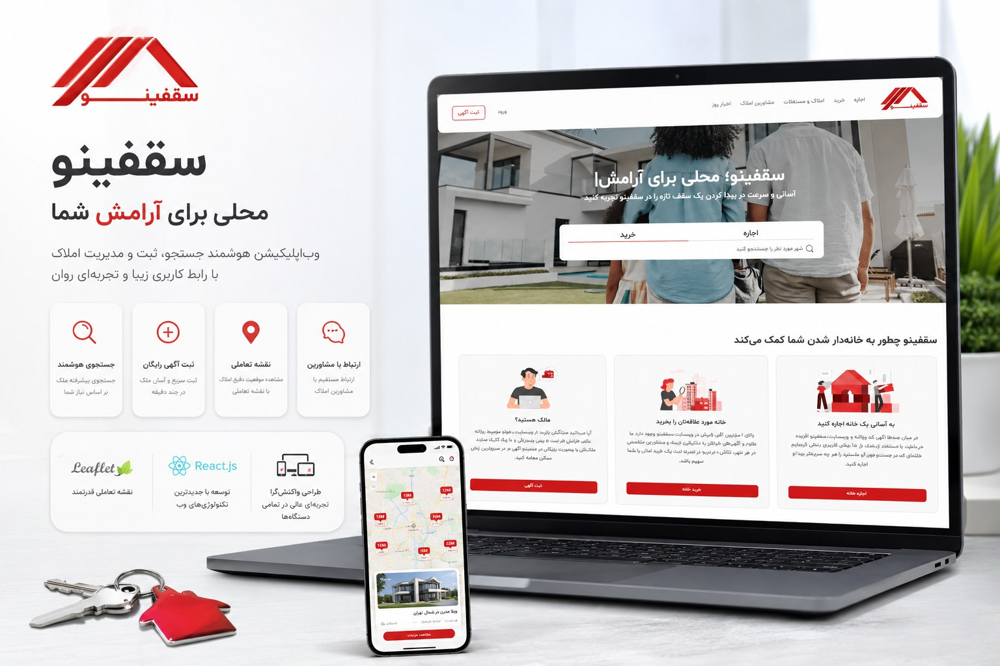
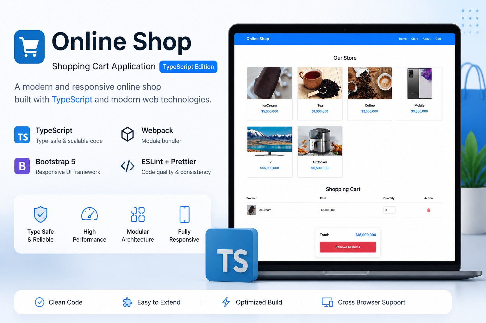
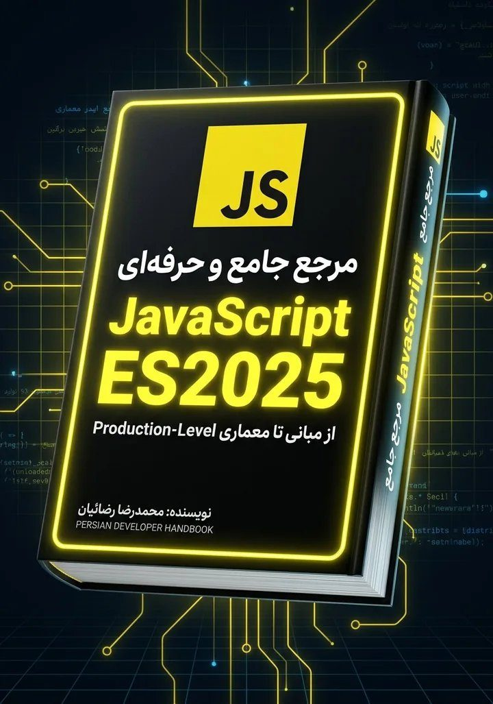
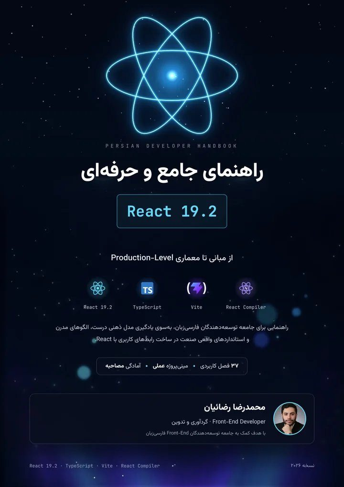
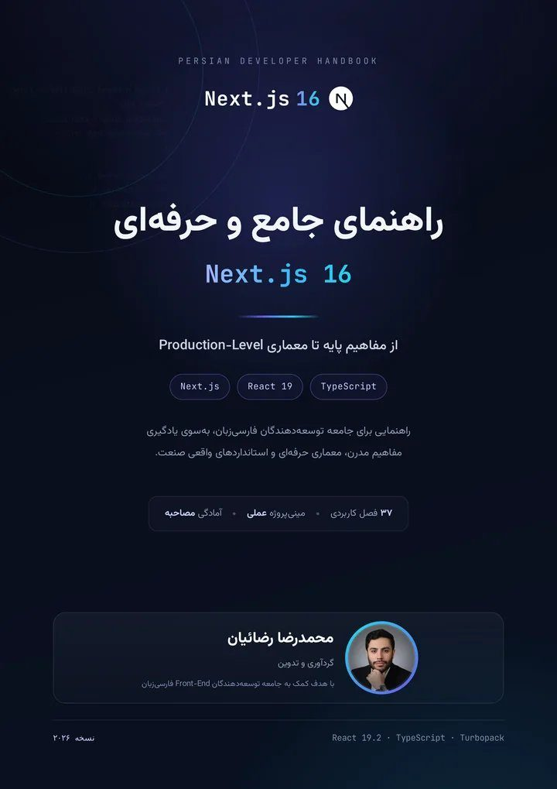
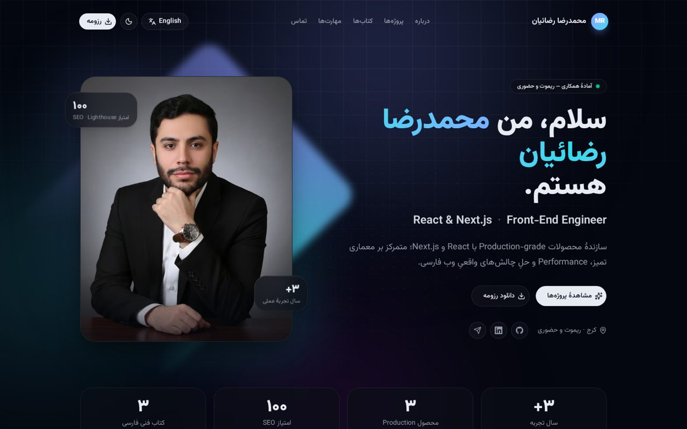
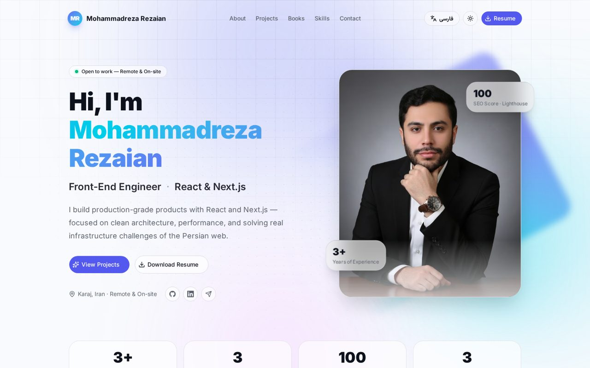

<a id="top"></a>

<div align="center">



<br />
<br />

# Hi, I'm Mohammadreza Rezaian 👋

### Front-End Engineer · React & Next.js

**I build production-grade web products** — with a focus on clean architecture, performance,  
and solving the real infrastructure challenges of the Persian web.

<br />

<p>
  
  
  
</p>

<p>
  <a href="https://www.linkedin.com/in/mr-rezaian"></a>
  <a href="https://t.me/rezaian_dev"></a>
  <a href="mailto:mrezaian.dev@gmail.com"></a>
  <a href="public/MohammadReza_Rezaian_Resume.pdf"></a>
</p>

</div>

<br />

---

## 🧭 About Me

I'm a Front-End engineer specialised in **Next.js, React and TypeScript**, with hands-on experience shipping real products — not demos, not templates.

- 🏗️ I've built a **full-stack medical booking platform** (secure auth, multi-layer caching, three-tier automated tests) and a **scalable real-estate SPA** with an interactive map and 17 custom hooks
- 🇮🇷 Deep experience with **Persian-market UX**: Jalali calendar, Tehran timezone handling, RTL-first interfaces
- ⚡ Obsessed with **performance, SEO and accessibility** — measured, not assumed
- ✍️ Author of **three free Persian handbooks** on JavaScript, React 19 and Next.js 16
- 🎓 B.Sc. Electrical Engineering — Electronics

> **"I fix the root cause instead of applying a quick patch."**

<br />

## 🚀 Featured Work

<table>
  <tr>
    <td width="50%" valign="top">
      
      <h3>🩺 Doctor Booking</h3>
      <p><b>Full-Stack · Production</b></p>
      <p>Online medical appointment platform on Next.js App Router — Jalali-calendar booking, reviews &amp; ratings, Tiptap-powered articles and a complete admin panel. JWT on httpOnly cookies, hashed OTP with brute-force protection, multi-layer caching with Upstash Redis.</p>
      <p><b>167</b> components · <b>26</b> API routes · <b>9</b> data models · <b>17</b> test files<br />Lighthouse: <b>93</b> Perf · <b>93</b> A11y · <b>92</b> BP · <b>100</b> SEO</p>
      <p><code>Next.js 16</code> <code>React 19</code> <code>TypeScript</code> <code>Tailwind v4</code> <code>MongoDB</code> <code>Redis</code> <code>Zod</code> <code>Playwright</code></p>
      <a href="https://github.com/rezaian-dev/doctor-booking"></a>
    </td>
    <td width="50%" valign="top">
      
      <h3>🏠 Saghfinoo</h3>
      <p><b>Front-End · Scalable SPA</b></p>
      <p>Real-estate platform for buying, selling and renting — domain-driven architecture, advanced multi-filter search, multi-step listing creation, interactive Leaflet map for neighbourhood-level discovery, and memoization tuned across 100+ call sites.</p>
      <p><b>107</b> components · <b>17</b> custom hooks · <b>12</b> pages</p>
      <p><code>React 18</code> <code>Vite</code> <code>React Router 7</code> <code>MUI</code> <code>Tailwind</code> <code>React Hook Form</code> <code>React-Leaflet</code></p>
      <a href="https://github.com/rezaian-dev/saghfinoo"></a>
    </td>
  </tr>
  <tr>
    <td width="50%" valign="top">
      
      <h3>👗 Malli Kids</h3>
      <p><b>Full-Stack · Client Work</b> &nbsp;</p>
      <p>E-commerce for a children's clothing atelier — storefront, customer account and admin console on Next.js 16. Server Components by default, ISR catalogue, Better Auth, stock locking at checkout, Jalali-expiring coupons and a virtual try-on flow.</p>
      <p><code>Next.js 16</code> <code>React 19</code> <code>TypeScript</code> <code>Tailwind v4</code> <code>MongoDB</code> <code>Better Auth</code> <code>Zod</code></p>
    </td>
    <td width="50%" valign="top">
      
      <h3>🛒 ShoppingCart</h3>
      <p><b>Front-End · Open Source</b></p>
      <p>Lightweight, responsive shopping cart in strict TypeScript with Webpack and Bootstrap 5 — add / remove products, update quantities and dynamic totals with a modular architecture.</p>
      <p><code>TypeScript</code> <code>Webpack</code> <code>Bootstrap 5</code> <code>ESLint + Prettier</code></p>
      <a href="https://github.com/rezaian-dev/shopping-cart-ts"></a>
    </td>
  </tr>
</table>

<br />

## 📚 Persian Handbooks

Three free, open-source guides focused on **mental models and technical decision-making** — not API memorisation.

<table align="center">
  <tr>
    <td align="center" width="33%">
      <br /><br />
      <b>JavaScript ES2025</b><br /><sub>38 chapters · from mental model to production architecture</sub><br /><br />
      <a href="https://rezaian-dev.github.io/javascript-persian-guide/"></a>
      <a href="https://github.com/rezaian-dev/javascript-persian-guide"></a>
    </td>
    <td align="center" width="33%">
      <br /><br />
      <b>React 19.2</b><br /><sub>37 chapters · Actions, Suspense, React Compiler, architecture</sub><br /><br />
      <a href="https://rezaian-dev.github.io/react-19-persian-guide/"></a>
      <a href="https://github.com/rezaian-dev/react-19-persian-guide"></a>
    </td>
    <td align="center" width="33%">
      <br /><br />
      <b>Next.js 16</b><br /><sub>37 chapters · App Router, Cache Components, deployment</sub><br /><br />
      <a href="https://rezaian-dev.github.io/nextjs-16-persian-guide/"></a>
      <a href="https://github.com/rezaian-dev/nextjs-16-persian-guide"></a>
    </td>
  </tr>
</table>

<br />

## 🛠️ Tech Stack

<table>
  <tr>
    <td><b>Core</b></td>
    <td>
      
      
      
      
    </td>
  </tr>
  <tr>
    <td><b>UI &amp; Styling</b></td>
    <td>
      
      
      
      
      
    </td>
  </tr>
  <tr>
    <td><b>State &amp; Data</b></td>
    <td>
      
      
      
      
    </td>
  </tr>
  <tr>
    <td><b>Backend-for-Frontend</b></td>
    <td>
      
      
      
      
    </td>
  </tr>
  <tr>
    <td><b>Quality &amp; Tooling</b></td>
    <td>
      
      
      
      
      
    </td>
  </tr>
</table>

<br />

## 📌 Engineering Highlights

| | |
|:--|:--|
| ⏰ **Jalali-calendar scheduling** | Reads Tehran wall-clock time independent of server timezone — slots never drift; one active appointment per user per day |
| 🔐 **Security hardening** | JWT + httpOnly cookies, bcrypt hashing, hashed OTP with timing-safe comparison, Redis-backed brute-force protection |
| ⚡ **Performance & SEO** | Multi-layer caching (`revalidateTag` + Upstash Redis), ISR, dynamic metadata, `next/image`, code-splitting |
| 🧩 **Scalable architecture** | Logic extracted into 17+ custom hooks, memoization tuned across 100+ call sites, components organised by domain |

<br />

## 🌐 Portfolio Website

This repository also hosts my personal portfolio — **bilingual (FA / EN), light & dark, measured CLS 0.00**.

<table align="center" width="100%">
  <tr>
    <td align="center"><b>🌙 Persian · Dark</b></td>
    <td align="center"><b>☀️ English · Light</b></td>
  </tr>
  <tr>
    <td></td>
    <td></td>
  </tr>
</table>

<p align="center">
  
  
  
  
  
</p>

```bash
npm install && npm run dev    # → http://localhost:3000
```

<br />

## 📫 Let's Connect

<div align="center">

<a href="mailto:mrezaian.dev@gmail.com"></a>
<a href="https://www.linkedin.com/in/mr-rezaian"></a>
<a href="https://t.me/rezaian_dev"></a>
<a href="tel:+989018106646"></a>

<br />
<br />

<sub><b>Type-Safe</b> · <b>Clean Code</b> · <b>Minimal Scope</b> · <b>Measurable Quality</b></sub>

<br />
<br />


</div>

---

<div align="center">
  <sub>© 2026 Mohammadreza Rezaian · <a href="#top">Back to top ↑</a></sub>
</div>
